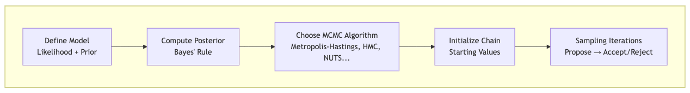
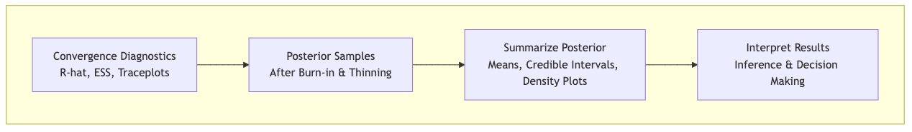

 
## Introduction {auto-animate=true}

### Chromatin Architecture: Classical Inference {data-id="ice-dist"}

* Hi-C Reads $\rightarrow$ Interaction matrix
* Iterative Correction and Eigendecomposition (ICE)
* Assign $A$ to $\mathrm{E1} > 0$ and $B$ to $\mathrm{E1} < 0$  

### Our Goal: Bayesian Probabilistic inference

* Model the $\mathrm{E1}$ as *observed* random variable (RV) under following assumptions:
  * $\mu_a$ and $\mu_b$ can be drawn from $\mathcal{N}(0.5, \sigma)$ and $\mathcal{N}(-0.5, \sigma)$.
  * We can infer latent state from the value of $mu$ by a fitting prior. 
  * Add spatial dependency with a Random Walk

::: notes
I will start us off with a *very* brief introduction to chromatin architecture and the classical inference of compartment type. First, using the special Hi-C sequencing method, physically proximal DNA-sequences are linked in paired-end reads. By aligning and parsing the reads into proper (valid) pairs, we obtain the raw interaction matrix. Now, due to technical artifacts and for example differential binding of the restriction enzyme, the coverage along the genome will not be uniform. This will cause a *visibility bias* where some regions will appear more or less important than they are in reality. Here comes the ICE.
Therefore, we have to correct the interaction matrix, and we do so iteratively until the variance is minimized and coverage is uniform. Now, borrowing a distance decay from polymer physics, the expected interaction frequency is calculated, and PCA is performed on the correlation matrix of the observed over the expected interaction matrix. So, we are a couple of steps away from the raw interaction matrix.
:::

## Introduction {auto-animate=true}

::: {data-id="ice-dist" .nocap .tight style="width:900px;margin:0 auto"} 

:::

### Our Goal: Bayesian Probabilistic inference

* Model the $\mathrm{E1}$ as *observed* random variable (RV) under following assumptions:
  * $\mu_a$ and $\mu_b$ can be drawn from $\mathcal{N}(0.5, \sigma)$ and $\mathcal{N}(-0.5, \sigma)$.
  * We can infer latent state from the value of $mu$ by a fitting prior. 
  * Add spatial dependency with a Random Walk
  * *Predict  more precise compartment transitions*

::: notes 
This yields a 1D track of E1 values along the genome, and counting these for the Macaque data leads to one of the basic assumptions for the aim of this project; that the eigenvectors come from two distinct distributions, and that we can model this probabilistically. We think of the compartment type as a latent variable that emits an eigenvector, and we can infer that latent state by Bayesian MCMC methods by choosing the right prior. 
:::

## Bayesian inference: Markov Chain Monte Carlo

:::: {layout="[1,1,-1]"}

::: {#left}
### Bayes' rule
:::
::: {#right style="text-align:left;"}
$$
P(\theta \mid D) = \frac{P(D \mid \theta)\, P(\theta)}{P(D)}
$$
:::
::::

{.fragment}

{.fragment}

::: notes
1. We begin by specifying a statistical model: a likelihood for the data and priors for the parameters
2. Using Bayes' rule, we combine likelihood and prior into the posterior distribution we want to explore
3. We select a Markov Chain Monte Carlo algorithm appropriate for our model and parameter space
4. We start the sampler from initial parameter values, which can influence early chain behavior
5. The algorithm propoeses new parameter values and accepts or rejects them according to the posterior
6. We monitor convergence with diagnostics like R-hat, effective sample size, and visual checks
7. Once convergence is reached, we tretain samples after burn-in and possible thin them to reduce autocorrelation
8. We summarise the posterior with point estimates, uncertainty intervals and visualizations
9. Finally, we interpret the posterior to draw conclusions or support decisions made under uncertainty
:::
 
## Model architectures {auto-animate=true}

:::: {.columns}
::: {.fragment .column width="50%"}

### Simple (i.i.d.) model

::: {data-id="simple" style="width:65%;transform:scale(0.75);transform-origin: top left;"}

:::
:::
::: {.column width=50%}
:::
::::  

::: notes 
These are the models that I used. First, the simplest possible model. The bins are i.i.d., and the parameters are the fewest possible. The shape of `mu` and `sigma` is to, indicating that it is fitting two distinct values for each. The mixing weight is drawn from a uniform prior.
:::

## Model architectures {auto-animate=true}

:::: {.columns}
::: {.column width="50%"}

### Simple (i.i.d.) model 

::: {data-id="simple" style="width:65%;transform:scale(0.75);transform-origin: bottom left;margin-top:56%;margin-left:auto"}

:::
:::

::: {.column width="50%"}

### More complex (GRW) model 



:::
::::

::: notes
Then, I fitted a more complex model. Here I introduce spatial dependency with a Random walk and *also* introduce a hard type-assignment by putting a Bernoulli trial on the resulting mixing weight. The result is a much slower sampling, but it conceptually sticks better with biology. Inversing the expectation of decay in interaction frequency, we expect that the difference in E1 between adjacent bins is constricted by some physical property, and we aim to model that step size. A Random Walk is the cummulative sum of random steps along the genome. The vector of steps is then passed through a sigmoid function to force the values between 0 and 1 to resemble the probability of being in an A compartment. This is either used directly as a mixing weight or passed through a Bernoulli trial as a probabilistic if-statement. 
Then it turned out that PyMC devs says we *might as well* just marginalize the discrete variable, as the posterior mean will approximate the mixing weight anyways. 
:::

## Analysis

### PyMC

* Probabilistic Programming Language (PPL) module for Python
* Leverages the No-U-Turn Sampler (NUTS)
* Fully integrates with *Arviz* and *PyTensor* methods for analyses

:::: {layout="[-10,40,40,-10]" style="padding-top:100px;"}
::: {}
{height="200px" width="200px"}
:::

::: {}
{height="150px" width="350"}
:::
::::

::: notes
Okay, I said most of this already, but a convenient way of doing probabilistic inference is with PyMC. They state themselves it is a PPL, whatever that means, except it allows me to do my analysis. 
It is based off of the NUTS sampler a very efficient sampler compared to older algorithms, and it leverages *Arviz* and *PyTensor*. 
:::

## Results (Macaque)

:::: {.columns style="text-align:center;font-size:0.5em;" }
::: {#left .column .fragment .nocap .tight style="width:50%;margin: 0;"}

**Simple (i.i.d.)**





:::
::: {#right .column .fragment .nocap .tight style="width:50%;height:450px; margin: 0 auto;"}

**GRW model**




:::
::::

::: notes
Let's dive straight into the results of the initial runs:
First, I ran the i.i.d. model and did not expect it to perform well, but as a kind of null model and to get the feel of PyMC. Initially it looked like it was capturing the observed distribution, and it looked very good on the cross-validation. But, when investigating the posterior mean, it was a completely flat curve. I actually do not understand how both of these [**ppc** and **y_post**] can be true. 
Then the random walk was implemented, showing the same good mixing and following the same posterior predictive distribution. Then it looked worse on the LOO-PIT, but a lot more encouraging in the `y_post`. So it seems like the actual predictive of the observed variable switches along the genome, resembling the observed curve. Then I rationalize that if the purpose of the model is to reduce importance of small, short compartments, it is by definition a worse fit than the unrestricted model. Maybe the i.i.d. model is just overfitting, and we cannot really use the measure for evaluating. It might still be feasible for model comparison (between GRW models), as we then introduce the same bias. 
:::

## Results (Macaque)

### Summarize

* [x] 100kb to reduce runtime
* [x] Dispute about the CV results
* [x] Seemingly promising posterior predictive
* [ ] Use high resolution (and longer runtime)

::: notes
* So, until now I have performed some initial analysis on coarse data
* I have talked briefly about the validity of CV results
* We have a seemingly promising posterior for the GRW model
* We are just missing the high resolution analysis, so here is where it becomes a bit spicy
:::

## Results (Human data)

:::: {.columns style="margin:0;"}
::: {.column width="20%"}
### ICE
:::
::: {.column .tight style="width:80%;transform:scale(0.65);transform-origin: top left;font-size:0.6em;padding-top:10px;"}

:::
::::

::: notes
Okay, so I performed the ICE analysis on human sperm on chromosome X, and as we can see, the noise level for 10kb (that I continue with) is very high. 
:::

## Results (10kb Human data short arm)

### Cut to the trace - E1 estimate

::: {.tight style="font-size:0.6em;"}

:::

::: notes
Next, I fitted both the discrete and continuous GRW models to the short arm, and as we can see, the discrete model seems to switch back and forth, even for the mean of the posterior. I realized I could delay it no longer, and fitted the model to the full chrX.
:::

## Results (10kb Human data full)

### E1 estimate

::: {.tight style="font-size:0.6em;"}

:::

::: notes
We see the exact same pattern, where the discrete model seems to take jumps in the posterior predictive, which is not so useful, as we then have many many single-bin compartments. So it is clearly not resembling our biological understanding after all. The continuous model looks better. 
:::

## Results (10kb Human data full)

### Latent space (logit through sigmoid): $w$

::: {.tight style="width:90%;font-size:0.6em;margin:0 auto"}

:::

::: notes 
So let's look at the latent `w` variable on the continuous model, and fast forward a couple of steps. I made a function to map the crossings of a given threshold for the full posterior, where the predicition is *uncertain*, into a list of intervals. Within these intervals, I count the number of curves that cross in either direction, resulting in a distribution of crossings at each transition zone, which could be translated into a credible point of transition. 
:::

## Autosomal comparison (chr8) {auto-animate=true}
:::: {.columns .tight style="font-size:0.6em;margin:0 auto;"}
::: {.column style="width:50%;transform:scale(0.85);transform-origin: top center;"}

:::
::: {.column style="width:50%;transform:scale(0.75);transform-origin: top center;"}

:::
::::

::: notes
Then, skipping a couple of steps forward again, I did the same analysis on chr8 in X- and Y-bearing sperm to compare the two. Here, the model only fully mixes when fitted to the X-bearing data, but not on the Y-bearing. Here, a new mode is introduced halfway between the two expected modes. 
:::

## Autosomal comparison (chr8) {auto-animate=true}

:::: {.columns .tight style="font-size:0.6em;margin:0 auto;"}
::: {.column style="width:45%;transform:scale(0.85);transform-origin: top center;"}

:::
::: {.column style="width:55%;transform:scale(0.80);transform-origin: top center;"}


:::
::::

::: notes
And we can also see from the rank plot that grw_sigma is not uniform throughout the draws (it is supposed to be).
This has a large effect on the HDI interval on the posterior predictive, even though the PPC plot shows it follows the observed. 
Up until this point, I had not investigated the chains separately, but I thought now is the time to do
:::

## Autosomal comparison (chr8) {auto-animate=true}

### A bit of cherry-picking 

:::: {.columns .tight .center style="font-size:0.6em;margin:0 auto;"}
::: {.column style="width:45%;transform:scale(0.95);transform-origin: top center;padding-top:8px;"}

:::
::: {data-id="trans-zones" .column style="width:55%;transform:scale(0.95);transform-origin: top center;"}

:::
::::

::: notes 
Clearly, the new mode introduced in the trace plots results in a completely new posterior distribution of `w`. Which is what happens when a chain is stuck in a limited parameter space. 
Then Kasper suggested I could do some cherry-picking (which I think is fine as long as we are open about it) to see where the model could take us. By picking the red curve (the chains deemed 'good'), we narrow the HDI for the posterior (as expected).
:::

## Autosomal comparison (chr8) {auto-animate=true}

### A bit of cherry-picking 

:::: {.columns .tight .center style="font-size:0.6em;margin:0 auto;"}
::: {data-id="trans-zones" .column style="width:50%;transform:scale(0.95);transform-origin: top center;"}

:::
::: {.fragment .column style="width:50%;transform:scale(0.95);transform-origin: top center;padding-top:3px;"}

:::
::::

::: notes 
So let's look at the posterior predictive for these two, with the filtered draws:
Now they both resemble a typical path of the E1, but I have no quantitative comparison between them.
I have mapped the CI intervals as previously ready for comparing the distributions. 
I think this is a good initial exploration of the method, leaving plenty of points for future studies. 
:::

## Limitations

### Resolution/Sparsity

::: {.tight style="width:90%;transform:scale(0.95);transform-origin: top center;margin:0 auto;font-size:1.2rem;"}

:::

::: notes
But we have to talk about the limitations to this: the sparsity of the data I used is far beyond the recommendation, and I think it was a step too far. Additionally, we observe a change in the E1 distribution when decreasing resolution, and 100kb is more so resembling the initial assumption than the 10kb. 
:::

## Limitations

* We do not know *ground truth* [@kalluchi2023considerationscaveatsanalyzing]; too sparse data for PCA or the modeling?
  * Definitely not good that not all chains mix
  * The chains seem to mix at 100kb more often
* Revisit the assumption about compartment strength\*
* No quantitative comparison

::: aside
\* @chen2019keyrolectcf: $\log(\text{AA} \times \text{BB}/\text{AB}^2)$
:::

::: notes
Additionally, we do not know ground truth as also noted by the review. 
We should also revisit the assumption that the magnitude of the E1 is biologically representing (even just somewhat) the strength of association
And as stated, we have no quantitative comparison of the fit of the model. 
:::

## Future Analyses

* Dial in the model on more abundant data (e.g. [@wang2019reprogrammingmeioticchromatin])
  * Compare the genomic intervals (quantitatively) with the ICE types
  * Adaptive prior scaling (e.g. take resolution, or variance into account)
* Compare **compartment strength** between X- and Y-bearing sperm in *all* autosomes
  * May be used as an indicator for chromosomes of interest
* Try out *CScoreTool* [@zheng2018cscoretoolfasthic]
  * MLE approach suitable for sparse data

## References

